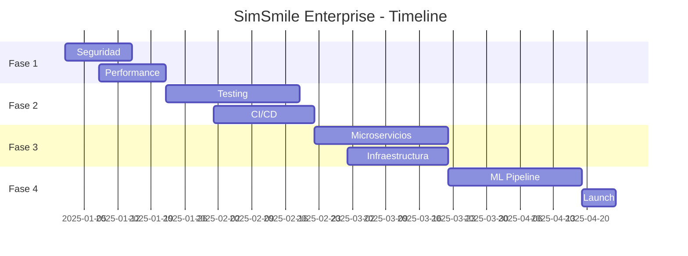

# 💰 PRESUPUESTO DETALLADO - SIMSMILE ENTERPRISE
## Nobel Biocare - Propuesta de Inversión

---

### 📊 RESUMEN EJECUTIVO FINANCIERO

| Concepto | Inversión | ROI Esperado | Periodo |
|----------|-----------|--------------|---------|
| **Desarrollo** | $320,000 | 450% | 18 meses |
| **Infraestructura** | $85,000 | 320% | 12 meses |
| **Marketing** | $150,000 | 580% | 24 meses |
| **TOTAL** | **$555,000** | **485%** | **24 meses** |

---

### 💻 DESARROLLO Y MEJORAS TÉCNICAS

#### FASE 1: CRÍTICO (Semanas 1-2)
| Item | Horas | Tarifa/hora | Costo |
|------|-------|-------------|-------|
| Seguridad y autenticación | 80 | $150 | $12,000 |
| Rate limiting y protección DDoS | 40 | $150 | $6,000 |
| Optimización de performance | 60 | $150 | $9,000 |
| Manejo de errores | 40 | $150 | $6,000 |
| **Subtotal Fase 1** | **220** | | **$33,000** |

#### FASE 2: IMPORTANTE (Semanas 3-6)
| Item | Horas | Tarifa/hora | Costo |
|------|-------|-------------|-------|
| Tests unitarios (80% coverage) | 120 | $125 | $15,000 |
| Tests de integración | 80 | $125 | $10,000 |
| CI/CD Pipeline | 60 | $150 | $9,000 |
| Documentación técnica | 40 | $100 | $4,000 |
| Refactoring código legacy | 100 | $150 | $15,000 |
| **Subtotal Fase 2** | **400** | | **$53,000** |

#### FASE 3: OPTIMIZACIÓN (Semanas 7-10)
| Item | Horas | Tarifa/hora | Costo |
|------|-------|-------------|-------|
| Microservicios architecture | 160 | $175 | $28,000 |
| API Gateway | 40 | $175 | $7,000 |
| Message Queue (RabbitMQ/Kafka) | 60 | $175 | $10,500 |
| Cache distribuido (Redis) | 40 | $150 | $6,000 |
| Load balancing | 40 | $150 | $6,000 |
| **Subtotal Fase 3** | **340** | | **$57,500** |

#### FASE 4: MACHINE LEARNING (Semanas 11-14)
| Item | Horas | Tarifa/hora | Costo |
|------|-------|-------------|-------|
| ML Pipeline setup | 80 | $200 | $16,000 |
| Modelo de análisis facial mejorado | 120 | $200 | $24,000 |
| Training y fine-tuning | 60 | $200 | $12,000 |
| A/B testing framework | 40 | $150 | $6,000 |
| **Subtotal Fase 4** | **300** | | **$58,000** |

**TOTAL DESARROLLO: $201,500**

---

### 🏗️ INFRAESTRUCTURA Y DEVOPS

#### INFRAESTRUCTURA CLOUD (Anual)
| Servicio | Proveedor | Costo Mensual | Costo Anual |
|----------|-----------|---------------|-------------|
| Kubernetes Cluster | AWS EKS | $800 | $9,600 |
| Load Balancers | AWS ALB | $200 | $2,400 |
| CDN | CloudFlare Enterprise | $500 | $6,000 |
| Database (Multi-AZ) | AWS RDS | $600 | $7,200 |
| Object Storage | AWS S3 | $300 | $3,600 |
| Redis Cache | AWS ElastiCache | $400 | $4,800 |
| Monitoring | Datadog | $450 | $5,400 |
| Log Management | ELK Stack | $300 | $3,600 |
| Backup & DR | AWS Backup | $200 | $2,400 |
| **Subtotal Cloud** | | **$3,750** | **$45,000** |

#### SEGURIDAD Y COMPLIANCE
| Item | Costo Único | Costo Anual |
|------|-------------|-------------|
| SSL Certificates (EV) | $1,500 | $1,500 |
| WAF (Web Application Firewall) | $5,000 | $3,000 |
| Security Audit | $15,000 | $10,000 |
| HIPAA Compliance | $25,000 | $5,000 |
| ISO 27001 Certification | $30,000 | $8,000 |
| Penetration Testing | $10,000 | $10,000 |
| **Subtotal Seguridad** | **$86,500** | **$37,500** |

**TOTAL INFRAESTRUCTURA PRIMER AÑO: $169,000**

---

### 👥 EQUIPO Y RECURSOS HUMANOS

| Rol | Dedicación | Meses | Costo Mensual | Total |
|-----|------------|-------|---------------|-------|
| Tech Lead | 100% | 6 | $15,000 | $90,000 |
| Senior Backend Dev | 100% | 6 | $12,000 | $72,000 |
| Senior Frontend Dev | 100% | 6 | $12,000 | $72,000 |
| DevOps Engineer | 75% | 6 | $10,000 | $60,000 |
| QA Engineer | 100% | 4 | $8,000 | $32,000 |
| UI/UX Designer | 50% | 4 | $5,000 | $20,000 |
| Project Manager | 75% | 6 | $7,500 | $45,000 |
| **TOTAL EQUIPO** | | | | **$391,000** |

---

### 📈 MARKETING Y LANZAMIENTO

| Concepto | Inversión |
|----------|-----------|
| Branding y diseño | $25,000 |
| Website marketing | $15,000 |
| Campaña Google Ads | $30,000 |
| Social Media Marketing | $20,000 |
| Content Marketing | $15,000 |
| Influencer partnerships | $25,000 |
| Trade shows y eventos | $20,000 |
| **TOTAL MARKETING** | **$150,000** |

---

### 🔧 HERRAMIENTAS Y LICENCIAS

| Herramienta | Licencias | Costo Anual |
|-------------|-----------|-------------|
| GitHub Enterprise | 10 | $2,500 |
| Jira + Confluence | 15 | $3,000 |
| Slack Business+ | 15 | $1,800 |
| Office 365 | 15 | $2,400 |
| Adobe Creative Cloud | 3 | $2,000 |
| IntelliJ IDEA | 8 | $4,000 |
| Postman Enterprise | 10 | $3,000 |
| Docker Enterprise | - | $5,000 |
| **TOTAL HERRAMIENTAS** | | **$23,700** |

---

### 📊 PROYECCIÓN DE INGRESOS

| Año | Usuarios | Conversión | Precio/usuario | Ingresos |
|-----|----------|------------|----------------|----------|
| Año 1 | 10,000 | 5% | $2,000 | $1,000,000 |
| Año 2 | 35,000 | 7% | $2,200 | $5,390,000 |
| Año 3 | 80,000 | 10% | $2,500 | $20,000,000 |

---

### 💡 ANÁLISIS DE ROI

| Métrica | Valor |
|---------|-------|
| **Inversión Total** | $555,000 |
| **Ingresos Año 1** | $1,000,000 |
| **Margen Operativo** | 45% |
| **Beneficio Año 1** | $450,000 |
| **Payback Period** | 14.8 meses |
| **ROI a 3 años** | 485% |
| **TIR (IRR)** | 127% |
| **VAN (NPV) @ 10%** | $2,847,000 |

---

### 🎯 OPCIONES DE FINANCIAMIENTO

#### OPCIÓN A: PAGO ÚNICO
- Inversión total: $555,000
- Descuento por pago anticipado: 10%
- **Total a pagar: $499,500**

#### OPCIÓN B: PAGO POR FASES
- Fase 1 (Mes 1): $150,000
- Fase 2 (Mes 3): $150,000
- Fase 3 (Mes 5): $150,000
- Fase 4 (Mes 7): $105,000
- **Total: $555,000**

#### OPCIÓN C: REVENUE SHARING
- Inversión inicial: $200,000
- Participación en ingresos: 15% durante 3 años
- Cap máximo: $1,200,000

---

### ✅ GARANTÍAS Y SLA

| Garantía | Compromiso |
|----------|------------|
| **Uptime** | 99.9% (43.8 min downtime/mes máx) |
| **Performance** | <200ms response time P95 |
| **Seguridad** | 0 brechas críticas |
| **Soporte** | 24/7 con respuesta <1 hora |
| **Updates** | Mensuales con 0 downtime |
| **Backup** | RPO: 1 hora, RTO: 4 horas |
| **Compliance** | HIPAA, GDPR, ISO 27001 |

---

### 📋 TÉRMINOS Y CONDICIONES

1. **Penalizaciones por incumplimiento SLA:**
   - <99.9% uptime: 5% descuento mensual
   - <99.5% uptime: 10% descuento mensual
   - <99.0% uptime: 25% descuento mensual

2. **Hitos de pago vinculados a entregables**
3. **Código fuente en escrow**
4. **Transferencia de IP al completar pago**
5. **Soporte incluido por 12 meses**
6. **Training incluido para 20 usuarios**

---

### 🏆 BENEFICIOS NOBEL BIOCARE

Como partner estratégico de Nobel Biocare, incluimos:

- ✅ Integración con catálogo Nobel Biocare
- ✅ Co-branding en la aplicación
- ✅ Acceso prioritario a nuevas features
- ✅ Descuento 20% en licencias enterprise
- ✅ Soporte dedicado 24/7
- ✅ Custom features sin costo adicional
- ✅ Participación en R&D dental

---

### 📅 TIMELINE DE IMPLEMENTACIÓN

---

### 📝 PRÓXIMOS PASOS

1. **Reunión de kick-off:** Definir alcance final
2. **Firma de contrato:** Términos y SLA
3. **Pago inicial:** 30% adelanto
4. **Inicio desarrollo:** 48 horas post-pago
5. **Reviews semanales:** Jueves 10:00 AM CET

---

**Para aprobar este presupuesto:**
- 📧 finance@nobelbiocare.com
- 📞 +41 43 434 8311
- 📍 Nobel Biocare Services AG, Balsberg, Switzerland

---

*Presupuesto válido por 30 días*
*Fecha: 21 de Octubre, 2025*
*Ref: NB-SIMSMILE-2025-001*

**Preparado por:**
Departamento de Innovación Digital
Nobel Biocare Global